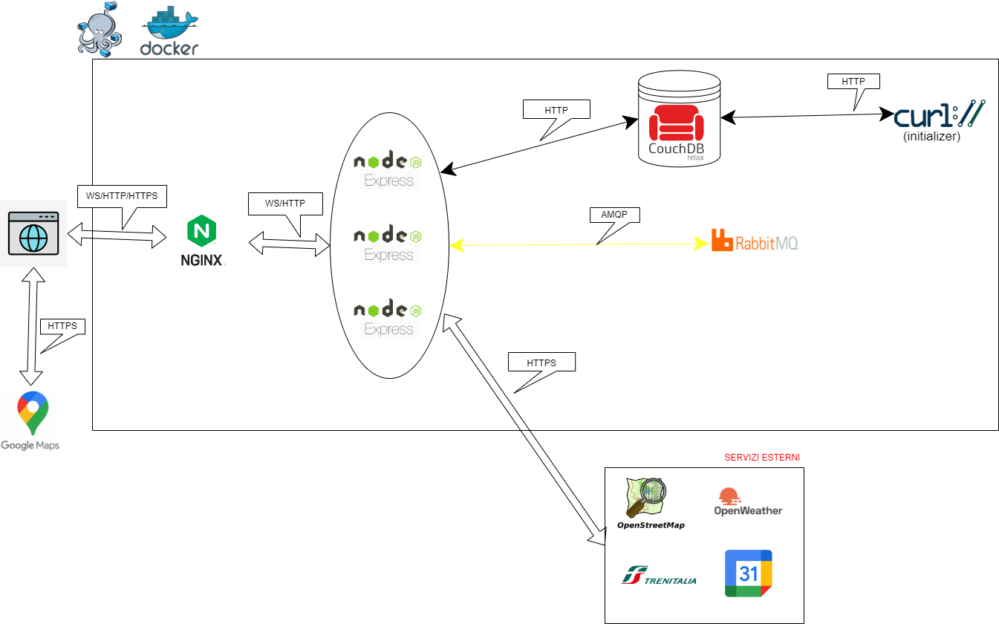

# Italia in Viaggio - Progetto Reti di Calcolatori 
Realizzato da Aras Leonardo Kankilic (1888465) e Francesco Saverio Sconocchia Pisoni (18889241)

## SCOPO DEL PROGETTO

Italia in Viaggio si propone come un'alternativa innovativa nel mondo della ricerca degli alloggi e un portale di informazione per invogliare alla scoperta dei borghi più belli che possiede il nostro paese.

L'idea è quella di permettere ai viaggiatori e agli albergatori di entare in diretto contatto, senza enti intermediari di prenotazione, col fine di ottenere un risparmio reciproco azzerando le commissioni presenti sui suddetti portali. La nostra soluzione prevede quindi l'uso dei dati pubblici di Google Maps per ottenere in modo più trasparente informazioni e contatti di riferimento di ogni alloggio presente in un determinato borgo, con l'obiettivo in futuro di poter visionare anche il prezzo stimato.

Il viaggiatore procede autonomamente alla prenotazione dell'alloggio e sempre tramite il nostro portale può verificare in tempo reale il meteo previsto per la settimana corrente e soluzioni di viaggio in treno offerte da Trenitalia da e verso quel borgo. Infine può salvare un promemoria del riepilogo del viaggio sul proprio Calendar di Google tramite autorizzazione OAuth.

Per i turisti indecisi sulla meta offriamo un servizio di suggerimento dei borghi da visitare in base alla distanza e il meteo o in base al costo minimo del viaggio in treno in funzione della stazione di partenza e dei giorni in cui vuole viaggiare nella settimana corrente.

## ARCHITETTURA DI RIFERIMENTO


## REALIZZAZIONE DEL PROGETTO
1. **Il servizio REST che implementate (lo chiameremo SERV) deve offrire a terze parti delle API documentate**
  
  L'applicazione offre [API](https://github.com/SangueSpada/ItaliaInViaggioRDC/blob/main/src/apidoc/api.js) consultabili direttamente sul sito su `/docs/index.html`. In particolare è possibile:
   - Ottenere la lista ordinata dei borghi raccomandati da visitare in base alla distanza e al meteo
   - Ottenere la lista ordinata dei borghi raccomandati da visitare in base al costo minimo del viaggio in treno

2. **SERV si deve interfacciare con almeno due servizi REST di terze parti di cui almeno uno commerciale e almeno uno che richiede OAuth**
  
  L'applicazione si interfaccia con le seguenti API esterne:
  - [Maps Javascript API](https://developers.google.com/maps/documentation/javascript?hl=it) per la visualizzazione grafica di una mappa di Google Maps e [Places API](https://developers.google.com/maps/documentation/places/web-service?hl=it) per la ricerca degli alloggi nei borghi.
  - [OpenStreetMap](https://www.openstreetmap.org/#map=6/42.088/12.564) per calcolare distanze e ricercare stazioni dei treni.
  - [OpenWeatherMap](https://openweathermap.org/) per conoscere il meteo dei borghi.
  - [Trenitalia](https://www.lefrecce.it/Channels.Website.WEB/) per cercare soluzioni di viaggi in treno da e verso i borghi.
  - [Google Calendar API](https://developers.google.com/calendar/api/quickstart/nodejs?hl=it) OAuth per autorizzare alla creazione dell'evento viaggio.

3. **La soluzione deve prevedere l'uso di protocolli asincroni. Per esempio Websocket e/o AMQP**

ws per http e wss per https (TBD)

4. **Il progetto deve prevedere l'uso di Docker e l'automazione del processo di lancio, configurazione e test, deve essere implementata una forma di CI/CD**

L'applicazione è completamente strutturata su containers Docker come illustrato nell'architettura. L'implmentazione del CI/CD viene realizzata tramite GITHUB Actions che verifica il corretto funzionamento dei test delle API offerte.

5. **Requisiti minimi di sicurezza devono essere considerati e documentati. Self-signed certificate sono più che sufficienti per gli scopi del progetto.**

Dal momento che non vengono scambiate informazioni sensibili fra Client e Server, è possibile accedere all'applicazione sia tramite protocollo *http* sia tramite *https*. All'interno del server si comunica in *http* mentre con le API esterne si scambiano informazioni in *https*.

## ISTRUZIONI PER L'INSTALLAZIONE E TESTING
L'installazione consiste nell'esecuzione da shell dei seguenti comandi:
```
git clone https://github.com/SangueSpada/ItaliaInViaggioRDC.git
cd ItaliaInViaggioRDC
npm install
```
creare il file `src/.env` contenente queste informazioni opportunamente compilate
```
API_MAPS="YOURS CREDENTIALS"
API_WHEATHER="YOURS CREDENTIALS"
CLIENT_ID_CALENDAR="YOURS CREDENTIALS"
SECRET_ID_CALENDAR="YOURS CREDENTIALS"
RED_URI="http://localhost:8080/seteventcalendar"
```
Infine per avviare o terminare l'esecuzione dei containers
```
docker-compose up
docker-compose down
```

Per eseguire il test del funzionamento delle API offerte
```
npm test
```


